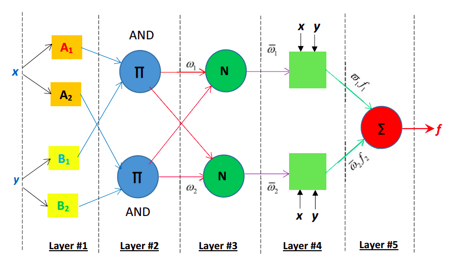

# Real-Time Optimization

The Quest For Rapid Response Methods

---
layout: statement
---

# Introduction

---
transition: slide-up
---

# Background

- There are many optimization methods in the wild
- Some, such as the **_Genetic Algorithm(GA)_**, have proven quite efficient
- But there's an issue when it comes to **_real-time optimization_**

---
layout: statement
---

# Motivating Example 1 - The Knapsack Problem

---

# Describing The Knapsack Problem 

- It involves a **_knapsack or bag_** with **_limited weight capacity_**
- A traveler has some **_items_**, each with a certain **_weight_** and **_value_**
- The traveler is faced with the challenge of occupying the bag with the **_most value_**, **_without exceeding the weight capacity_**

---

# Challenges With Deterministic Methods

- The time taken to solve this problem **_increases exponentially with number of inputs_** for current methods
- For certain problems, they often converge at a **_local optima_** which may be undesirable
- They usually require explicit **_mathematical models_** which can be **_complex to craft_**
- They can be **_inflexible_** especially when it comes to **_problem representation_**

---

# Introducing GA

- It is an innovative optimization method based on the **_Theory of Evolution_**
- It borrows from the theory three key concepts, **_heredity_**, **_variation_** and **_selection_**
- Through heredity, offsprings **_inherit genetic material_** from parents 
- Variation determines that there should be **_diversity_** in genetic material
- Selection is basically the same as **_survival of the fittest_**
- In this regard, a **_fitness function_** is required
- It's fundamental tuning parameters are **_population size_**, **_probability of crossover_** and **_probability of mutation_**
- Other tuning parameters could be defined, for example, **_number of generations_** is used if no other **_convergence criteria_** are specified

---

# Advantages Of GA

- It converges **_very quickly for this problem_**, even when inputs are **_dramatically increased_**
- It usually **_avoids local optima_** due to its tendency to **_thoroughly explore the problem space_**
- It doesn't require **_explicit mathematical modelling_** and is **_highly flexible_** in terms of **_problem representation_**

---

# Solving The Knapsack Problem With GA

---
transition: slide-up 
---

# Demo Of Solution To The Knapsack Problem 

<GADemo/>
---
layout: statement
---

# Motivating Example 2 - The Cart-Pole Problem

---

# Describing The Cart-Pole Problem

- It involves a **_pole_** being balanced on a **_cart_**
- An **_initial impulse_** is provided to create an imbalance 
- The cart is now required to **_offset the imbalance_** by **_dynamically altering its velocity_**

---

# Challenges With GA

- It can be **_computationally intensive_** and so **_faster methods_** are needed for **_real-time optimization_**

---

# Introducing The Fuzzy Inference System(FIS)

- It is a clever and intuitive optimization method based on the concept of **_Fuzzy Logic_**
- **_Linguistic or fuzzy variables_** are central to this concept
- The system considered here, the **_Mamdani Type FIS_**, comprises four steps 
- **_Fuzzification_**, the first step, requires determining the **_degree_** to which inputs belong to **_fuzzy sets_** according to **_membership functions_**
- **_Evaluation_**, the next step, involves the application of **_fuzzy rules_** to results obtained from fuzzification to determine their **_firing strengths_**
- **_Aggregation_** is then performed to **_combine_** the firing strengths obtained in light of the next step 
- **_Defuzzification_** is done to convert the output of aggregation into a **_crisp value_**

---

# Advantages Of FIS 

- It is **_much faster_** than metaheuristic optimization methods like GA 
- Much like those methods, it doesn't require **_explicit mathematical modelling_**
- It is also similar in **_flexibility_** and **_accuracy_**

---
transition: slide-up
---

# Solving The Cart-Pole Problem With FIS

---
layout: statement
---

# Motivating Example 3 - The CGAM Problem

---

# Describing The CGAM Problem

- It is a **_benchmark energy system_** designed to  **_examine exergoeconomic optimization approaches_**  
- In **_iterative exergoeconomic optimization_**, energy systems are optimized based on their **_individual components_**
- As a result, the optimization process centers around **_exergetic efficiency_**, $\varepsilon_{k}$ and **_relative cost difference_**, $r_{k}$ for each relevant component 
- The **_objective function_** being minimized is **_Cost$(US\$ h^{-1})$_** 
- The **_decision variables_** are as follows: 
- The **_isentropic efficiency of the compressor_**, $\eta_{ac}$
- The **_isentropic efficiency of the turbine_**, $\eta_{gt}$
- The **_temperature of the air entering the combustion chamber_**, $T_{3}$
- The **_temperature of the combustion products entering the gas turbine_**, $T_{4}$
- The **_pressure ratio of the compressor_**, $r_p = P_{2}/P_{1}$

---

# Describing The CGAM Problem

- The **_constraints_** are as follows:
$$ 
\begin{gather}
0.6 \le \eta_{ac} \le 0.9 \\
0.6 \le \eta_{gt} \le 0.9 \\
700 \le T_{3} \le 1000K \\
1200 \le T_{4} \le 1550K \\
6 \le r_{p} \le 16 \\
\end{gather}
$$ 

---

# Challenges Of FIS

- It becomes very **_tedious_** to define the **_knowledge base_** for especially large systems

---

# Introducing The Adaptive-Neuro Fuzzy Inference System(ANFIS)

- It is a **_build-up_** on FIS 
- It involves employing an **_Artificial Neural Network(ANN)_** to **_aid in defining the knowledge base_** of the system
- The ANN consists of **_five layers_**
- Layer 1 is **_adaptive_** and it aids in **_defining the premise parameter set_**
- Layer 2 is responsible for defining the **_rule firing strengths_** and is **_not adaptive_**
- Layer 3 is a **_non-adaptive_** layer responsible for **_normalizing the firing strengths_**
- Layer 4 is an **_adaptive_** layer that aids in **_defining the consequence parameter set_**
- Layer 5 is **_non-adaptive_** and is responsible for **_defuzzification_**
- Several methods such as **_back propagation_** and even **_metaheuristic algorithms such as GA_** can be used to **_drive the learning process_**
- Afterwards, the normal FIS process is applied

---

# Advantages Of ANFIS 

- It **_eliminates, to varying degrees, the difficulty_** involved in defining the **_knowledge base_** of the system  

---

# Solving The CGAM Problem With ANFIS

---

# Solving The CGAM Problem With ANFIS

  

---

# Conclusion And Recommendations

- FIS is better than metaheuristic approaches for real-time optimization
- ANFIS makes FIS easier to implement, although it does not completely eliminate the associated difficulty 
- Further research can be done on this front to reduce the complexity involved

---

# References

- Book; Modeling, Assessment, and Optimization of Energy Systems - Hoseyn Sayyaadi
- Application; ChatGPT 
- Playlist; https://youtube.com/playlist?list=PLn8PRpmsu08pSpYcLLkfXcYlcs5judk0d&si=3R2XXbj2rgNCmgRX
- Playlist; https://youtube.com/playlist?list=PL5aUnGmllpiuMAlbdrWZ1oZgGGAAJJ3pK&si=S3w0mQzysRoq7BQ1

---

# Any Questions?

- Please ask!